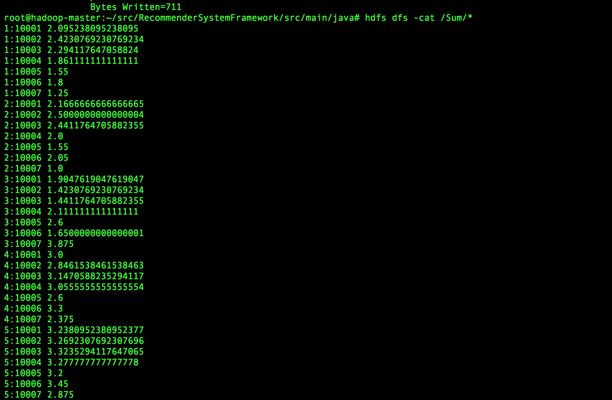

# Movie Recommender System project

## Overview
In this project, I implemented a 
movie recommender system based on Item Collaborative Filtering using Hadoop MapReduce and Java language.

This recommender Systems helps people find information that may interest them.

## Main Steps

#### Data preprocessing

Raw data is from Netflix Prize Challenge

I preprocessed the original dataset in two steps:

* Change the data in each movie file into the following format: UserID, MovieID, Rating.

* Merge 17770 movie files into one big input file since Hadoop is not good for dealing with lots of small files. And the big input file is the input of our recommender system.

#### steps:

* Divide  data by user id
* Build co-occurrence matrix
* Normalize the co-occurrence matrix
* Build rating matrix
* Multiply co-occurrence matrix and rating matrix


final result:




## Deploy
we deploy a hadoop cluster on Docker, this cluster has one Masternode and two slavenodes. The whole project is based on the docker.


```
hadoop com.sun.tools.javac.Main *.java

jar cf recommender.jar *.class

hadoop jar recommender.jar Driver /input /dataDividedByUser /coOccurrenceMatrix /Normalize /Multiplication /Sum
```

* args0: original dataset

* args1: output directory for DividerByUser job

* args2: output directory for coOccurrenceMatrixBuilder job

* args3: output directory for Normalize job

* args4: output directory for Multiplication job

* args5: output directory for Sum job


